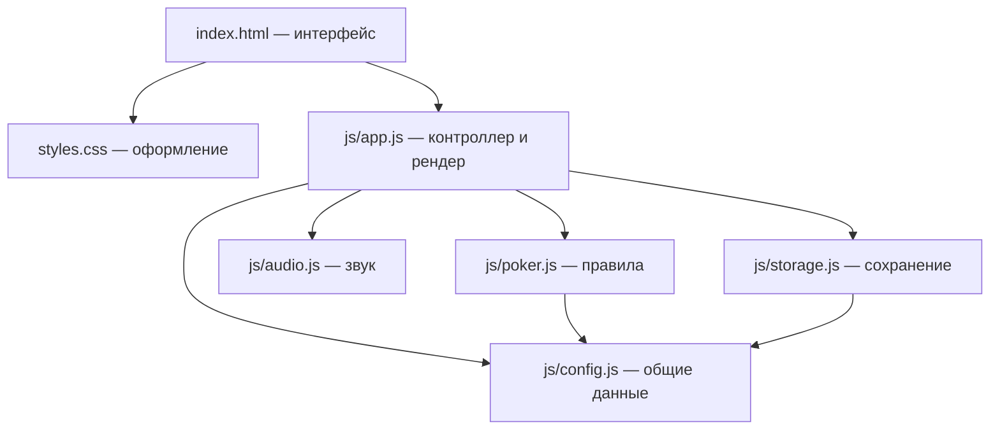
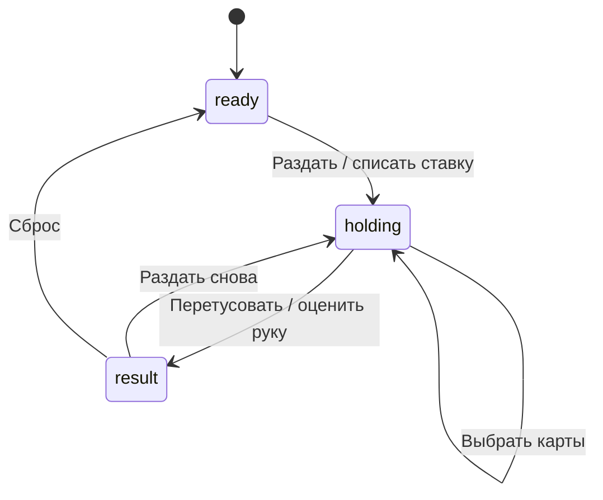

# Архитектура Электропокера

Документ описывает, где лежат части проекта, как они связаны и через какие состояния проходит игра. Проект работает прямо в браузере: сборщика, фреймворка, сервера приложений и внешних JavaScript-зависимостей нет.

## Общая схема



`app.js` — точка сборки приложения. Он хранит текущее состояние, вызывает независимые модули и отражает результат в DOM. Обратных импортов в `app.js` нет, поэтому покерная математика, звук и сохранение не знают о кнопках и HTML.

## Каталоги и файлы

```text
electric_poker_yanasolyah/
├── index.html                    # семантическая разметка игры и диалогов
├── styles.css                    # вся визуальная система, адаптивность и анимации
├── js/
│   ├── app.js                    # состояние, ход раунда, рендер и события
│   ├── poker.js                  # колода, оценка комбинаций и подсказки
│   ├── audio.js                  # синтез casino-jazz и сигналов Web Audio
│   ├── storage.js                # чтение и запись localStorage
│   └── config.js                 # масти, ранги, коэффициенты и ключ сохранения
├── assets/
│   ├── audio/music/              # место для будущих музыкальных файлов
│   ├── audio/sfx/                # место для будущих звуковых эффектов
│   ├── images/                   # иллюстрации и растровый фон
│   ├── icons/                    # SVG/PNG-иконки
│   ├── textures/                 # бесшовные текстуры и декоративные слои
│   └── screenshots/              # изображения для README и публикации
├── docs/
│   └── ARCHITECTURE.md           # этот документ
├── .github/workflows/pages.yml   # автоматическая публикация GitHub Pages
├── .gitignore                    # локальные файлы, не попадающие в Git
├── .nojekyll                     # отключение обработки проекта Jekyll
├── LICENSE                       # полный текст лицензии MIT
└── README.md                     # краткое описание, запуск и правила
```

Каталог `assets/` подготовлен, но текущая версия не требует файловых ресурсов: фон, логотип, лампы и карты нарисованы CSS, а музыка и эффекты синтезируются браузером. Правила размещения будущих ресурсов описаны в `assets/README.md`.

## Ответственность модулей

| Модуль | Получает | Возвращает или изменяет | Не должен делать |
|---|---|---|---|
| `config.js` | ничего | статические массивы и ключи | обращаться к DOM и хранилищу |
| `poker.js` | массивы карт | колоду, оценку руки, подсказки | рисовать интерфейс и менять баланс |
| `audio.js` | функцию доступа к настройкам, имя сигнала | звук через Web Audio | владеть состоянием игры |
| `storage.js` | часть состояния | безопасные сохранённые данные | сохранять колоду и анимационные флаги |
| `app.js` | события пользователя и результаты модулей | состояние и DOM | дублировать покерные правила |

Это модульно-функциональная архитектура, а не классическое ООП. Данные представлены объектами, но классов `Game`, `Deck` и `Hand` нет. Для текущего размера проекта это уменьшает количество служебного кода. При дальнейшем росте первым кандидатом на разделение будет `app.js`: контроллер раунда можно вынести отдельно от DOM-рендера.

## Состояние приложения

Единый изменяемый объект `state` находится в `js/app.js`.

| Поле | Назначение |
|---|---|
| `phase` | `ready`, `holding` или `result` |
| `balance` | текущие виртуальные очки игрока |
| `bet` | ставка текущего или следующего раунда |
| `sound`, `music` | пользовательские переключатели звука |
| `deck` | оставшиеся карты перемешанной колоды |
| `hand` | семь карт на столе |
| `selected` | семь флагов: какие карты заменить |
| `handHint` | собранная комбинация и текстовая подсказка |
| `lastWin`, `resultKey` | сумма и тип последнего результата |
| `winningIndices` | индексы пяти карт выигрышной комбинации |
| `history` | до 30 завершённых партий |
| `busy` | блокировка ввода на время анимации |

`state` — единственный источник правды для интерфейса. Функции `render()` и `renderCards()` читают его и обновляют DOM; обработчики событий сначала меняют состояние, затем вызывают рендер.

## Жизненный цикл раунда



1. `startHand()` проверяет баланс, списывает ставку, создаёт и перемешивает колоду, раздаёт семь карт.
2. `analyzeHandHints()` находит уже собранную комбинацию. Такие карты получают CSS-класс `made-combo` и зелёную подсветку.
3. `toggleHold()` переключает флаг карты в `selected`. Выбранные карты будут заменены.
4. `finishHand()` берёт новые карты только для выбранных позиций и вызывает `evaluateSeven()`.
5. Выигрыш равен `ставка × коэффициент`. Результат добавляется в историю и сохраняется.

Во время раздачи и перетусовки `busy = true`: это защищает состояние от двойных кликов и совпадает со временем анимации.

## Покерный движок

`makeDeck()` строит стандартную колоду из 52 объектов, объединяя данные ранга и масти из `config.js`. `shuffle()` применяет перемешивание Фишера—Йетса к этому массиву.

Рука содержит семь карт, а комбинация — пять. `evaluateSeven()` перебирает все `C(7,5) = 21` пятёрки, передаёт каждую в `evaluateFive()` и выбирает сильнейший результат. Приоритет определяется порядком элементов в `PAYOUTS`: верхняя строка массива всегда сильнее нижней.

`analyzeHandHints()` отвечает только за понятную подсказку интерфейса. Поле `madeIndices` используется для зелёной подсветки собранной пары, тройки, двух пар и других комбинаций. Поле `suggestedIndices` оставлено как результат движка для возможного будущего режима стратегии, но текущий интерфейс его специально не показывает.

## Рендер и стили

`index.html` содержит постоянный каркас: логотип, счётчики, контейнер семи карт, панель ставки, главную кнопку, нижние служебные кнопки и два диалога.

`renderCards()` заново создаёт семь кнопок-карт. В зависимости от состояния им добавляются классы:

| Класс | Значение |
|---|---|
| `active` | карту можно выбрать |
| `selected` | карта отмечена для замены |
| `made-combo` | карта входит в уже собранную комбинацию |
| `dealing` | анимация первой раздачи |
| `redrawing` | анимация замены |
| `winner` | карта входит в итоговую выигрышную пятёрку |

`setMessage()` добавляет кабинету класс `result-<key>`. Благодаря этому цвет и анимация результата задаются CSS, а JavaScript не содержит отдельных веток оформления для каждой комбинации.

`styles.css` построен каскадом: базовая геометрия, тема Midnight Jackpot, затем финальные полноэкранные и адаптивные переопределения. Это самый крупный файл проекта. При серьёзном расширении его можно разделить на `base.css`, `cabinet.css`, `cards.css`, `controls.css`, `dialogs.css` и `responsive.css`, подключив их из одного входного CSS.

## Музыка и звуки

`audio.js` использует Web Audio API. Осцилляторы, фильтры и огибающие создаются во время работы:

- casino-jazz состоит из 32 шагов гармонии, баса и редкой мелодии;
- чередование длинного и короткого интервала создаёт свинг;
- `playTone()` синтезирует короткие мотивы для клика, раздачи, проигрыша и выигрыша;
- `configureAudio(() => state)` даёт модулю доступ только к актуальным переключателям, не передавая ему владение состоянием.

Поэтому музыкальных `.mp3` и эффектов `.wav` сейчас нет. Если появятся готовые записи, их следует положить в `assets/audio/music/` и `assets/audio/sfx/`, после чего заменить или дополнить синтез в `audio.js`.

## Сохранение

`storage.js` хранит JSON под ключом `electropoker-save-v1`. Сохраняются только:

- баланс;
- ставка;
- настройки музыки и эффектов;
- последние 30 партий.

Колода, рука, выбранные карты и флаг `busy` намеренно не сохраняются: после перезагрузки незавершённый раунд не восстанавливается. `loadSave()` проверяет типы и допустимые значения, чтобы повреждённый `localStorage` не ломал запуск.

## Где что менять

| Задача | Основное место | Связанные места |
|---|---|---|
| изменить коэффициенты | `js/config.js` → `PAYOUTS` | справка в `index.html` |
| добавить новую комбинацию | `js/config.js`, `js/poker.js` | стили `result-*`, справка |
| изменить подсказки | `js/poker.js` → `analyzeHandHints()` | `renderCards()` в `app.js` |
| изменить ход раунда | `startHand()` / `finishHand()` в `app.js` | `state.phase`, `render()` |
| изменить размеры карт | секции Cards/Responsive в `styles.css` | контейнер `#cards` |
| изменить фон или логотип | `styles.css` | будущие файлы в `assets/images/` или `assets/icons/` |
| изменить музыку | `js/audio.js` | переключатель `music` в состоянии |
| изменить историю | `renderHistory()` в `app.js` | схема сохранения в `storage.js` |
| изменить текст справки | `index.html` | коэффициенты в `config.js` |

Коэффициенты пока продублированы в `config.js` и HTML-справке. При частой балансировке разумно генерировать справку из `PAYOUTS`, чтобы исключить расхождение.

## Публикация

Файл `.github/workflows/pages.yml` запускается при каждом push в `main`:

1. получает исходники;
2. настраивает GitHub Pages;
3. загружает весь корень как статический артефакт;
4. публикует сайт.

`.nojekyll` сообщает GitHub Pages, что проект не нужно обрабатывать Jekyll. Относительные пути `styles.css` и `js/app.js` позволяют сайту одинаково работать локально и в подпапке GitHub Pages.
